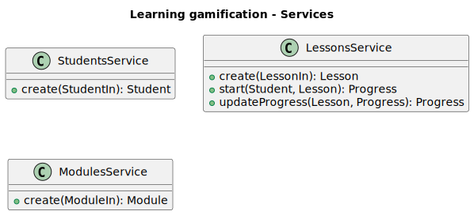

# Learning gamification

This application will deal with a gamified context of the process of learning
new things. Each lesson will give to the `Student` some `score points`, and these score points will
accumulate as `Experience points`.

### Goals

 - Provide the basics of a achievement service
 - Keep data of users about their learning progress
 - Provide a easy-to-use API for any client to consume

### Non-Goals

 - Provide a full learning system
 - Keep data of user's interests

## Overview

Student's score are points that will be actived by completing
lessons, these lessons can be found at modules that group multiple
lessons, and each lesson will contain a worth in points for the student
to actieve.

## First look at the design

